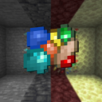

# Rand'Ore

*Simple random ores for Fabric!*

> **This mod is open source and under a permissive license.** As such, it can be included in any modpack on any platform without prior permission. We appreciate hearing about people using our mods, but you do not need to ask to use them. See the [LICENSE file](LICENSE) for more details.

This is a fairly simple mod that adds four kinds of random ores that generate in the three vanilla dimensions naturally and rarely. As their names, they drop vanilla ores after being mined.
